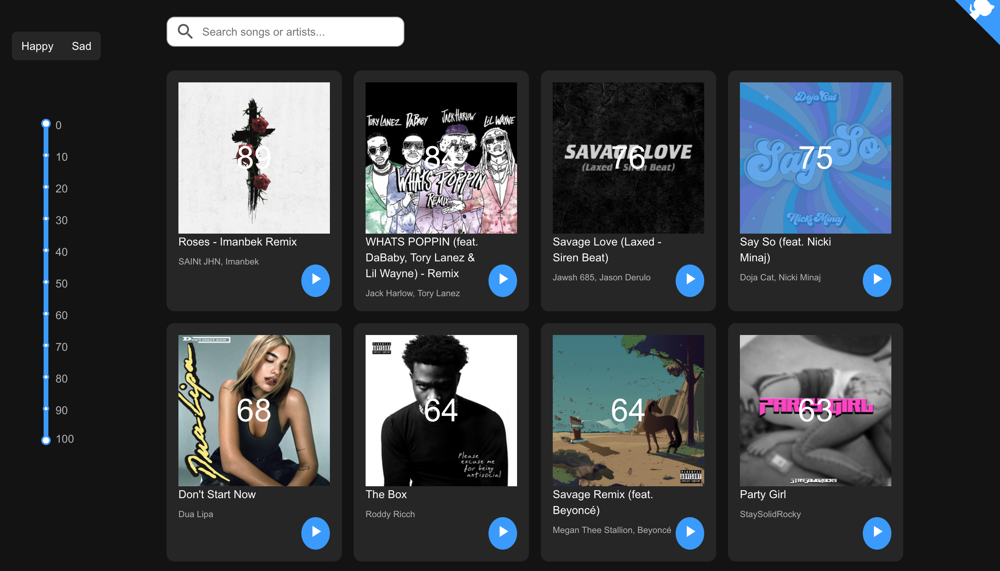

# Moodify
Moodify recommends you popular songs from the [Billboard Hot 100](https://www.billboard.com/charts/the-billboard-hot-100) based on your mood. Each song is scored on a scale of 0 to 100 using the [valenence feature](https://developer.spotify.com/documentation/web-api/reference/tracks/get-audio-features/) of Spotify API.



<br/>

## Key Features
- Fetching the top 45 song tracks from Billboard Hot 100
- Displaying the songs with a mood score on a scale of 0 to 100, with 0 being very sad, and 100 being very happy.
- Being able to play and pause song previews
- Being able to filter and sort recommended songs from the left side bar.
- Able to search for other songs and artists in a search bar.

## Technologies
- React JS
- Axios
- Spotify API
- React Suite

## Installation
- To run this app on your own computer, you need have/create a [Spotify](https://www.spotify.com/) user account.
- Register this application [Spotify Developer Dashboard](https://developer.spotify.com/dashboard/). You can register your application, even before you have created it.
- Check out [this article](https://levelup.gitconnected.com/how-to-build-a-spotify-player-with-react-in-15-minutes-7e01991bc4b6) if you have trouble figuring things out up to this point
- Git clone this repo.
- Move into the folder from your terminal:
```sh
    cd Moodify
```
- Run `npm install` to install node dependencies.
- Go into `src` folder, and change the filename of `config.test.js` to `config.js`.
- Inside the `config.js`, type in your `client_id` and `client_secret` from the [Spotify Developer Dashboard](https://developer.spotify.com/dashboard/)
- Run `npm start` to view the app in your browser
